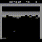

# Decision Transformer in JAX

Features:
1. Atari envs
2. Tensorboard & WandB
3. Better performance than offical coding

## Training Curve
Run 3 different seeds for each model, test 10 times at each evaluation. [WandB online](https://api.wandb.ai/links/wty-yy/06tql545)


## GIF


## Start
Use the same training dataset as [GitHub-decision-transformer](https://github.com/kzl/decision-transformer),
download dataset, please refer to [readme-atari.md](https://github.com/kzl/decision-transformer/blob/master/atari/readme-atari.md). Since **we just need 1% dataset**, bellow cmd can download minimal size:
```shell
mkdir ./dqn_replay/Breakout
gsutil -m cp -R gs://atari-replay-datasets/dqn/Breakout/1/ ./dqn_replay/Breakout
```
