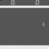

# Decision Transformer in JAX

## Features
1. Atari Env for evaluation uses `gymnasium`, instead of `atari_py`
2. Support `Tensorboard` & `WandB`
3. Better performance than offical coding in `Breakout`
4. Three models related to Transformer with offline RL: DT, RADT, StARformer (see [reference](#reference))

## Training Curve
Run 3 different seeds for each model, test 10 times at each evaluation. [WandB online](https://api.wandb.ai/links/wty-yy/06tql545)


## Result

| Algo/scores | CQL       | Decision-Transformer | StARformer                      | StARformer-JAX (Now) |
| ----------- | --------- | -------------------- | ------------------------------- | -------------------- |
| Breakout    | 55.8      | 76.9±17.1            | 108.16±50.2 (Run official code) | **118.23±31.1**      |
| Pong        | 13.5      | 12.8±3.2             | 16.4±2.1                        | **16.5±1.7**         |
| Seaquest    | 685       | 1131±168             | 781±212                         | **1321.3±59.7**      |
| Boxing      | 56.2      | 78.3±4.6             | 81.2±3.9                        | **86.4±2.8**         |
| Qbert       | **14012** | 3488±631             | 6968±1698                       | 13186.3±1930         |

## GIF

Evaluate `Breakout` by model `StARformer` training with `seed=0`, `391` scores.


Evaluate `Pong` by model `StARformer` training with `seed=0`, `20` scores.



Evaluate `Boxing` by model `StARformer` training with `seed=0`, `94` scores.


Evaluate `Qbert` by model `StARformer` training with `seed=0`, `14550` scores.


Evaluate `Seaquest` by model `StARformer` training with `seed=0`, `1480` scores.


## Start
### Download Dataset
Use the same training dataset as [GitHub-decision-transformer](https://github.com/kzl/decision-transformer),
download dataset, please refer to [readme-atari.md](https://github.com/kzl/decision-transformer/blob/master/atari/readme-atari.md). Since **we just need 1% dataset**, bellow cmd can download minimal size:
```shell
mkdir ./dqn_replay/Breakout
gsutil -m cp -R gs://atari-replay-datasets/dqn/Breakout/1/ ./dqn_replay/Breakout
```

### Training
- [`run.sh`](run.sh) for Decision Transformer.
- [`run_RADT.sh`](run_RADT.sh) for Return-Aligned Decision Transformer.
- [`run_StAR.sh`](run_StAR.sh) for StARformer.

Change the `--path-buffer-root` to your `dqn_replay` path in each running script.

## Reference

1. Decision-Transformer: https://arxiv.org/pdf/2106.01345.pdf, official code: https://github.com/kzl/decision-transformer
2. Return-Aligned Decision Transformer: https://arxiv.org/pdf/2402.03923.pdf
3. StARformer: Transformer with State-Action-Reward Representations for Visual Reinforcement Learning: https://arxiv.org/pdf/2110.06206.pdf, official code: https://github.com/elicassion/StARformer

